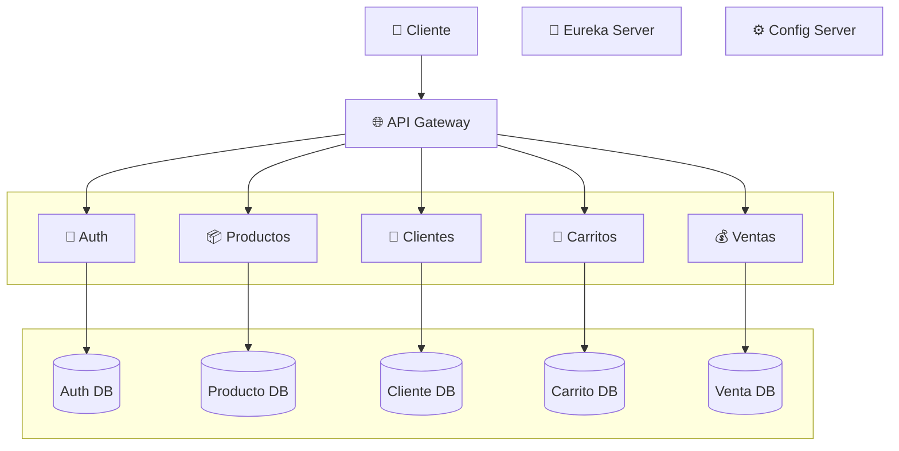
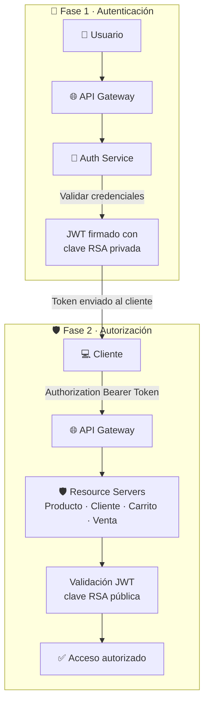

<div align="center">

# 🛒 ElectrodoStore
### Plataforma de Ventas basada en Microservicios


</div>

---

## 📖 Descripción General

ElectrodoStore es una aplicación backend desarrollada bajo una arquitectura de microservicios utilizando Spring Boot y Spring Cloud.

El sistema permite gestionar productos, clientes, carritos de compra, ventas y autenticación de usuarios mediante JWT, implementando patrones de diseño comúnmente utilizados en sistemas distribuidos modernos.

El objetivo principal del proyecto es demostrar conocimientos en diseño de arquitecturas escalables, seguridad, comunicación entre servicios y despliegue de aplicaciones distribuidas.

---

## 📚 Repositorios del Ecosistema

| Servicio | Descripción | Repositorio |
|------------|-------------|-----|
| deployment | Orquestación y despliegue completo mediante Docker Compose | [🔗 Ver repo](https://github.com/electrodostore/electrodostore-deployment) |
| config-server | Servidor de configuración centralizada (Spring Cloud Config Server) | [🔗 Ver repo](https://github.com/electrodostore/config-server) |
| config-repo | Repositorio Git con las configuraciones externas de los microservicios | [🔗 Ver repo](https://github.com/electrodostore/electrodostore-config-server-repo) |
| eureka-server | Registro y descubrimiento de servicios (Service Discovery) | [🔗 Ver repo](https://github.com/electrodostore/eureka-server) |
| api-gateway | Punto único de entrada al ecosistema de microservicios | [🔗 Ver repo](https://github.com/electrodostore/api-gateway) |
| auth-service | Autenticación, autorización y emisión de JWT | [🔗 Ver repo](https://github.com/electrodostore/auth-service) |
| producto-service | Gestión de productos y catálogo | [🔗 Ver repo](https://github.com/electrodostore/producto-service) |
| cliente-service | Gestión de clientes | [🔗 Ver repo](https://github.com/electrodostore/cliente-service) |
| carrito-service | Gestión de carritos de compra | [🔗 Ver repo](https://github.com/electrodostore/carrito-service) |
| venta-service | Procesamiento y registro de ventas | [🔗 Ver repo](https://github.com/electrodostore/venta-service) |

---

## 🏗️ Arquitectura General



Todos los microservicios obtienen su configuración desde Config Server y se registran automáticamente en Eureka Server
para permitir descubrimiento dinámico y balanceo de carga.

---

## 📦 Microservicios

| Servicio | Responsabilidad |
|-----------|----------------|
| Auth Service | Autenticación, emisión y validación de JWT |
| Producto Service | Gestión de catálogo de productos |
| Cliente Service | Gestión de clientes |
| Carrito Service | Gestión de carritos de compra |
| Venta Service | Procesamiento de ventas |

---

## 🔐 Seguridad

La plataforma implementa autenticación y autorización basada en JWT con Spring Security,
siguiendo una arquitectura **stateless** con tokens firmados en **RSA256**, validación
distribuida via **OAuth2 Resource Server** y control de acceso por **roles y permisos (RBAC)**.

### 🔒 Flujo de Seguridad



---

## 👥 Modelo de Autorización

El sistema implementa Role-Based Access Control (RBAC).

<table>
<tr>
<th>🔴 ADMIN</th>
<th>🟢 CLIENT</th>
</tr>
<tr>
<td>

- `CREATE_PRODUCT`
- `UPDATE_PRODUCT`
- `DELETE_PRODUCT`
- `CREATE_ROLE`
- `ASSIGN_PERMISSION`
- `MANAGE_USERS`

</td>
<td>

- `CREATE_CART`
- `CREATE_SALE`
- `READ_OWN_PROFILE`
- `READ_OWN_CART`

</td>
</tr>
</table>

Esto permite desacoplar los permisos de los roles y facilita la escalabilidad del sistema de autorización.

---

## ☁️ Patrones de Microservicios Implementados

### 🌐 API Gateway
Centraliza el acceso a todos los microservicios y actúa como punto único de entrada.

### 🔍 Service Discovery (Eureka)
Permite registrar y localizar dinámicamente instancias de servicios sin depender de direcciones IP fijas.

### ⚙️ Config Server
Centraliza la configuración de todos los microservicios mediante un repositorio Git externo.

### 🗄️ Database per Service
Cada microservicio posee su propia base de datos independiente para reducir el acoplamiento entre dominios.

### ⚖️ Load Balancing
Distribución automática de tráfico entre múltiples instancias de un servicio.

### 🔌 Circuit Breaker
Protección frente a fallos en comunicaciones remotas para aumentar la resiliencia del sistema.

---

## 🔄 Comunicación entre Servicios

Los microservicios se comunican utilizando:

- REST APIs
- Spring Cloud OpenFeign
- Eureka Service Discovery
- Spring Cloud LoadBalancer

Ejemplos de comunicación:

```
Carrito Service → Cliente Service
Carrito Service → Producto Service
Carrito Service → Venta Service
```

---

## 🗄️ Persistencia

El proyecto sigue el patrón **Database per Service**.

Cada dominio administra su propia base de datos MySQL:

| Base de datos | Servicio propietario |
| --- | --- |
| `auth-db` | auth-service |
| `cliente-db` | cliente-service |
| `producto-db` | producto-service |
| `carrito-db` | carrito-service |
| `venta-db` | venta-service |

Esta estrategia mejora la escalabilidad, independencia de despliegue y desacoplamiento entre dominios.

---

## 🚀 Características Principales

- Arquitectura basada en microservicios.
- Configuración centralizada mediante Spring Cloud Config.
- Descubrimiento dinámico de servicios con Eureka.
- API Gateway como punto único de entrada.
- Autenticación JWT con firma RSA256.
- OAuth2 Resource Server para validación distribuida.
- Control de acceso basado en roles y permisos (RBAC).
- Base de datos independiente por microservicio.
- Comunicación entre servicios mediante OpenFeign.
- Balanceo de carga automático.
- Circuit Breaker para resiliencia.
- Despliegue completo con Docker Compose.

---

## 🚀 Casos de Uso Implementados

### Administración

- Gestión de productos
- Gestión de usuarios
- Gestión de roles
- Gestión de permisos
- Asignación de permisos a roles

### Clientes

- Registro de usuario
- Inicio de sesión
- Consulta de perfil
- Creación de carrito
- Consulta de carrito
- Registro de ventas

### Seguridad

- Autenticación JWT
- Autorización basada en roles
- Autorización basada en permisos
- Protección de endpoints
- Ownership sobre recursos del cliente

---

## ⚙️ Tecnologías Utilizadas

<div align="center">

### Backend


### Spring Cloud


### Arquitectura


### Seguridad


### Infraestructura


</div>

---

## 🐳 Despliegue

Todos los servicios se encuentran completamente dockerizados.

### Configuración previa

Crear el archivo `.env` basado en `.env.example`:

```bash
cp .env.example .env
```

Completar las variables de entorno necesarias:

```env
CONFIG_SERVER_URL=http://config-server:8888
EUREKA_URL=http://eureka-server:8761/eureka

JWT_USER_GENERATOR=electrodostore-auth-service

GITHUB_URL=
GITHUB_USERNAME=
GITHUB_TOKEN=
```

### Ejecución

```bash
docker compose up --build
```

El despliegue iniciará:

| Servicio | Tipo |
| --- | --- |
| Config Server | Infraestructura |
| Eureka Server | Infraestructura |
| Auth Service | Microservicio |
| Producto Service | Microservicio |
| Cliente Service | Microservicio |
| Carrito Service | Microservicio |
| Venta Service | Microservicio |
| API Gateway | Infraestructura |
| Bases de datos MySQL | Persistencia |

---

## 🧠 Decisiones de Arquitectura

<details>
<summary><b>¿Por qué JWT?</b></summary>
<br>
Permite una autenticación Stateless eliminando la necesidad de almacenar sesiones en el servidor.
</details>

<details>
<summary><b>¿Por qué RSA?</b></summary>
<br>
Separa la responsabilidad de firmar y validar tokens mediante claves privada y pública, mejorando la seguridad en entornos distribuidos.
</details>

<details>
<summary><b>¿Por qué Eureka?</b></summary>
<br>
Permite descubrimiento dinámico de servicios y facilita el escalado horizontal.
</details>

<details>
<summary><b>¿Por qué una base de datos por microservicio?</b></summary>
<br>
Reduce el acoplamiento entre dominios y permite independencia en el despliegue y evolución de cada servicio.
</details>

<details>
<summary><b>¿Por qué API Gateway?</b></summary>
<br>
Centraliza el acceso al sistema y simplifica la gestión de rutas y políticas de seguridad.
</details>

---

## 🎯 Objetivos de Aprendizaje

Este proyecto fue desarrollado como práctica avanzada de:

- Arquitectura de Microservicios
- Sistemas Distribuidos
- Spring Cloud Ecosystem
- Seguridad con Spring Security
- JWT y OAuth2 Resource Server
- Dockerización de aplicaciones
- Diseño de APIs REST

---

## 🔮 Mejoras Futuras

| Mejora | Descripción |
| --- | --- |
| 📡 Observabilidad | Zipkin / OpenTelemetry |
| 📋 Logs centralizados | Stack ELK o similar |
| 🔄 CI/CD | GitHub Actions |
| ☁️ Cloud | Despliegue en AWS |
| 🧪 Testing | Pruebas de integración automatizadas |
| ⚡ Cache | Cache distribuida con Redis |

---

## 👨‍💻 Autor

<div align="center">

Desarrollado por **Emanuel Atencia** como proyecto de aprendizaje y portafolio profesional.

</div>

---

## ⭐ Nota

> Este proyecto está enfocado en demostrar conocimientos de arquitectura backend y sistemas distribuidos. No incluye una interfaz frontend.